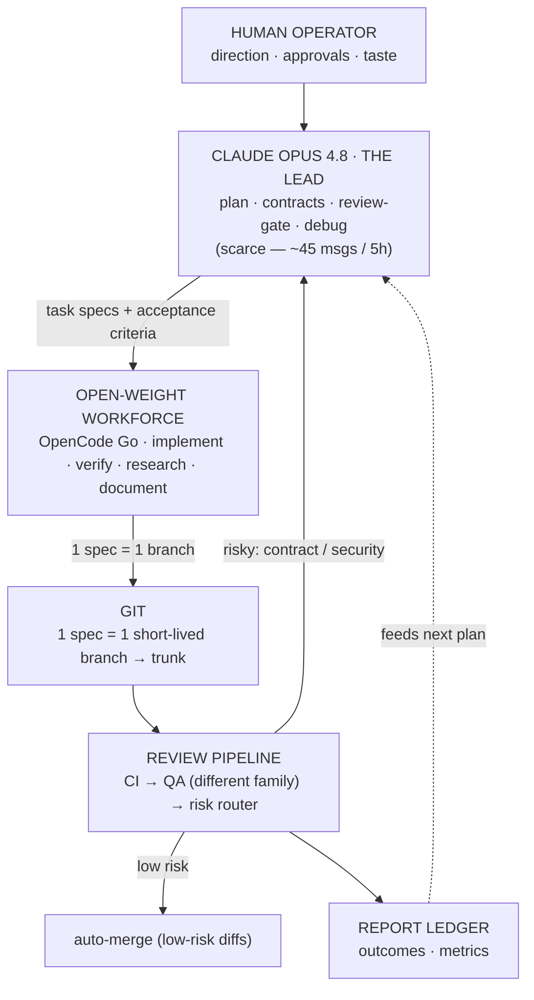

# Session Handoff — AI-Dev-OS

> Purpose: let a fresh Cowork session (any Claude model) resume this project cold.
> Read this top to bottom first, then jump to **"Where we are right now."**

---

## 1. What this project is

**AI-Dev-OS** — an orchestration system where a scarce, premium model (**Claude Opus 4.8, "the Lead"**)
produces **specs, contracts, and reviews**, and cheap **open-weight models** (via the **OpenCode Go**
gateway) do the bulk **implement / verify / research / document** work. The Lead never types CRUD;
it spends its limited messages only at leverage points (architecture, the review gate, hard bugs).

- Repo: **github.com/Hassa-Dollar/AI-OS** — **PUBLIC by choice, security-first** (never commit secrets;
  `gitleaks` gates every push). See `CLAUDE.md` §8.
- Stack: **Node 22 + TypeScript** (ESM, strict). The product being built is a tiny `node:http` service.
- Canonical docs already in the repo: `OPERATING_MANUAL.md` (full system), `CLAUDE.md` (Lead protocol),
  `AGENTS.md` (workforce rules + model pins), `architecture/README.md` (module map).

---

## 2. Where the project lives + how to work on it  (CRITICAL — read before touching anything)

- **Location:** WSL native filesystem — `~/projects/AI-OS` = `\\wsl.localhost\Ubuntu\home\hassa\projects\AI-OS`.
- **NOT in OneDrive.** OneDrive corrupts `.git` (proven: index corruption, unwritable `.git/index`). Never move it back.
- **Tooling split (important for Claude):**
  - The **bash sandbox CANNOT** mount the `\\wsl.localhost\` UNC path (errors with "UNC paths not supported").
  - The **file tools (Read/Write/Edit) CAN** reach it. So **Claude edits files via the file tools** at the
    `\\wsl.localhost\Ubuntu\...` path; **the human runs git / bash / scripts / opencode / npm** in their WSL terminal.
  - The file-tool path cache is **case-sensitive** (`Ubuntu` vs `ubuntu`) — pick one and stay consistent.
- **WSL toolchain (all installed & working):** Node 22 (`/usr/bin/node`), npm global prefix `~/.npm-global`
  (no sudo), `opencode` CLI (native Linux, authenticated to OpenCode Go), `gh` CLI (authenticated),
  `gitleaks` 8.24.3 (`/usr/local/bin`). Windows-PATH interop is **disabled** in `/etc/wsl.conf`
  (`appendWindowsPath = false`) so Windows binaries don't shadow the Linux ones.
- **GitHub:** branch protection on `main` (requires the `gate` status check, `enforce_admins`). All changes
  land via **PR → auto-merge**. `gate.sh` runs in **PR mode** (`GATE_MERGE=pr`; `local` fallback exists).
- **Daily cycle (since the ops-streamline PR) — TWO commands per task:**
  1. Lead writes the spec straight into `tasks/active/<id>-<slug>.md` (file tools; no queue-PR —
     `dispatch.sh` commits the spec onto the task branch, `gate.sh` archives it there, so spec +
     implementation merge to main together).
  2. `scripts/dispatch.sh <id>` → worker implements on the task branch.
  3. `scripts/ship.sh <id>` → gate (CI + cross-family QA + risk router + PR/auto-merge) **then** land
     (watch checks → confirm merge → sync main → prune branches → refresh this doc's AUTO-STATE).
  Risk-flagged diffs still stop at a DRAFT PR for the Opus gate — `land.sh` refuses to proceed past them.
  Process/docs changes by the Lead use a `chore/*` branch and the same `ship.sh` (it accepts branch names).

---

## 3. What we did this session (setup + hardening — all merged)

1. Relocated repo OneDrive → WSL; normalized line endings to **LF** (`.gitattributes`).
2. Pinned the real gateway slugs **`opencode-go/*`** (the free `opencode/*` tier lacks the strong models)
   in `AGENTS.md`, `scripts/new-task.sh`, and the example task. No `-thinking` slug exists; Kimi K2.6 serves the autonomous hat.
3. Wired CI: `scripts/ci-env.sh` (Node/TS commands) + recreated `.github/workflows/ci.yml`. **gitleaks-action
   needs `env: GITHUB_TOKEN: ${{ secrets.GITHUB_TOKEN }}`** to scan PRs — that fix is in.
4. Replaced placeholder invariants + `AGENTS.md` §4 conventions for TS/Node; wrote a real `architecture/README.md`.
5. Scaffolded the Node/TS skeleton: `package.json`, `tsconfig` (strict), `eslint.config.js` (flat), `vitest.config.ts`
   (coverage **report-only**, no hard global threshold — diff-coverage is the intended rule), `src/app.ts` (factory
   + tiny exact-match router), `src/routes/` (self-registered routes), `src/server.ts`, tests.
6. Recorded the **public + security-first posture** in `CLAUDE.md` §8.
7. Added a **pre-push hook** `.githooks/pre-push` (enable once: `git config core.hooksPath .githooks`).
8. Converted `gate.sh` to **PR mode**; fixed its verdict parser to tolerate markdown (`**VERDICT:** **pass**`);
   it now clears the verdict after an approve; gitignored `reviews/verdicts/*` and `reviews/queue/*`.

---

## 4. Tasks shipped through the pipeline

- **Task 000 — `GET /health`** → **MERGED** (PR #3). GLM-5.1 implemented, DeepSeek V4 Pro QA'd cross-family, auto-merged.
- **Task 001 — router pathname match** → **MERGED** (PR #6, 2026-06-09). GLM implemented with `new URL().pathname`;
  DeepSeek QA caught the dot-segment normalization leak (`/../health` → `/health`) with a raw-TCP repro → FAIL;
  the Lead replaced it with query-strip (`(req.url ?? '/').split('?')[0] ?? '/'`); re-QA → pass → auto-merged.
- **Pipeline hardening** → **PR #7** (2026-06-10): all four follow-ups from the 001 runs (see §6) + OPERATING_MANUAL
  synced (§11 embedded prompts, §6.6 schema example, review checklist). This handoff + the build-loop SVG became
  tracked under `docs/handoff/` in the same PR.

---

## 5. ⏯️ WHERE WE ARE RIGHT NOW  (resume here)

<!-- AUTO-STATE:BEGIN — generated by scripts/handoff.sh @ 2026-06-10T21:45:01Z; do not hand-edit -->
- **main:** `51475ee Merge pull request #8 from Hassa-Dollar/chore/ops-streamline`
- **checked-out branch:** `main` · worktree: clean
- **active task specs:** none · completed: 2
- **open PRs:** none
- **last ledger events:**
```
https://github.com/Hassa-Dollar/AI-OS/pull/3"
2026-06-08T22:21:25Z,dispatch,"001",main,hassa,"model=opencode-go/glm-5.1 verifier=opencode-go/deepseek-v4-pro branch=task/001-router-pathname-match"
2026-06-08T22:37:23Z,qa,001,task/001-router-pathname-match,hassa,"verifier=opencode-go/deepseek-v4-pro risk=med verdict=fail files=3 lines=91"
2026-06-09T16:45:57Z,qa,001,task/001-router-pathname-match,hassa,"verifier=opencode-go/deepseek-v4-pro risk=low verdict=pass files=3 lines=151"
2026-06-09T16:46:04Z,auto-approve,001,task/001-router-pathname-match,hassa,"pr=https://github.com/Hassa-Dollar/AI-OS/pull/6"
2026-06-10T21:45:01Z,land,ops,main,hassa,"branch=chore/ops-streamline main=51475eeb"
```
<!-- AUTO-STATE:END -->

> The block above is machine-written: `scripts/land.sh` refreshes it after every merge, or run
> `scripts/handoff.sh` manually. Hand-edit only the narrative below.

**Next: task 002.** Lead-recommended candidate: **405 Method Not Allowed** in `createApp` — when the path
exists but the method differs, return `405` + `Allow` header (today it 404s, which lies to clients). Bounded,
no contract changes, reuses 001's now-free `files_allowed`. Alternatives considered: graceful shutdown
(`src/server.ts`), `GET /version` (needs a thin-handler design decision first — costs Lead context).
**Verifier rotation:** use **Kimi K2.6** as verifier for 002 — DeepSeek graded both 000 and 001 (rotate, AGENTS §1).

---

## 6. Open follow-ups (Lead's to-do)

All four follow-ups surfaced by the 001 runs **landed in PR #7** (2026-06-10): mandatory final-commit step
(`prompts/task-execution.md` DO #5), strictly read-only verifier with inline `TESTS_SUGGESTED`
(`prompts/code-review.md`), dirty-worktree preflight in `gate.sh` (no more bogus "semantic conflict"),
and completion-report + Working-Notes as implicit `files_allowed` allowances (AGENTS §3, `new-task.sh`
template, manual). Still open:

1. **Keep this handoff current** — it is tracked in the repo now; refresh §4–§6 at the end of every session.
2. **Verifier rotation** — Kimi K2.6 verifies task 002 (DeepSeek did 000 + 001).
3. **CI shellcheck** — `scripts/*.sh` are only `bash -n`-checked today; consider a shellcheck step in ci.yml.

---

## 7. Recurring gotchas (will bite the next session if forgotten)

- **Editing a script via the file tools strips its `+x` bit.** `chmod +x scripts/<x>.sh` before committing, or run via `bash scripts/<x>.sh`.
- **`gate.sh` reuses an existing verdict** `reviews/verdicts/<id>.txt`. After a FAIL, `rm` it before re-gating or QA is skipped.
- **Branches made off an old `main`** lack later fixes. `gate.sh` rebases onto `main` first — but the worktree must be **clean** (commit the worker's output first).
- **`main` is protected** — no direct pushes. Everything goes via `gh pr create --fill --base main && gh pr merge --auto --merge`.
- **Cowork tooling quirks (verified 2026-06-10):** `Grep` works on the `\\wsl.localhost\` path but `Glob` does NOT
  (silently returns "No files found"); the bash sandbox refuses to start at all while a UNC folder is mounted —
  assume **file tools only**, human runs every command. Read-only git archaeology works via `.git/HEAD`,
  `.git/refs/**`, `.git/logs/HEAD` (reflog).
- **`git add -A` sweeps untracked directories** into the commit (that's how `docs/handoff/` entered PR #7 —
  intentional there, but always eyeball `git status -s` first).

---

## 8. The model roster

| Model | Role | Why | Gateway slug |
|---|---|---|---|
| **Claude Opus 4.8** | **Lead** | architecture · review gate · hard debugging (scarce, ~45 msgs/5h) | — (Claude Pro / API) |
| GLM-5.1 | Implementer (default) | reliable spec-to-code, long-horizon | `opencode-go/glm-5.1` |
| Kimi K2.6 | Autonomous worker + Verifier | tops agentic-coding; best long autonomous runs | `opencode-go/kimi-k2.6` |
| DeepSeek V4 Pro | Verifier | breaks code at the edges; ≠ author family (P8) | `opencode-go/deepseek-v4-pro` |
| Qwen3.7 Max | Researcher | 1M-context spikes → decision memos | `opencode-go/qwen3.7-max` |
| Qwen3.7 Plus | 2nd implementer / weekly synth | parallel impl; drafts weekly (Opus signs off) | `opencode-go/qwen3.7-plus` |
| MiniMax M3 | Multimodal | builds UI from designs & screenshots | `opencode-go/minimax-m3` |
| MiMo-V2.5-Pro | Scribe (mechanical) | docstrings · changelogs · template fill | `opencode-go/mimo-v2.5-pro` |
| local Qwen3-Coder-Next | Fallback | offline / secret-sensitive · $0 | `ollama/qwen3-coder-next` |

**Routing = blast-radius × irreversibility × spec-gap · P8: verifier ≠ author's model family · stack ≈ $30/mo.**

---

## 9. The build loop (diagram)

The polished version is the PNG saved alongside this handoff (`ai-dev-os-architecture-diagram.png`). Text version:


