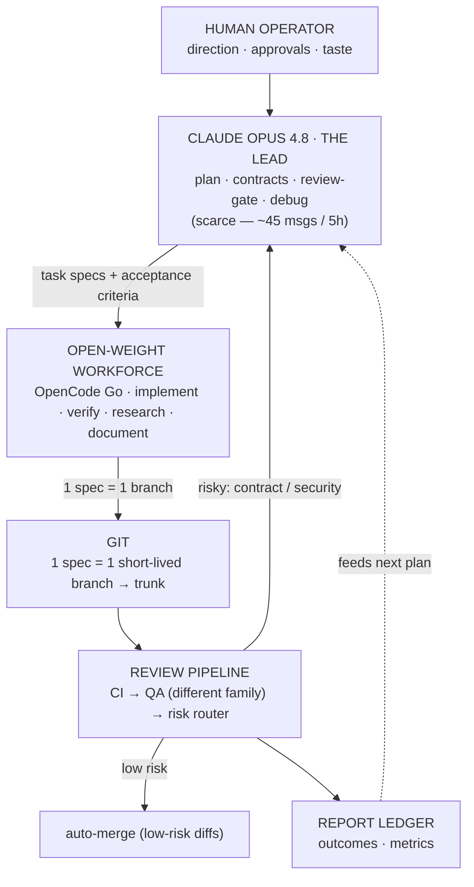

# Session Handoff — AI-Dev-OS

> Purpose: let a fresh Cowork session (any Claude model) resume this project cold.
> Read this top to bottom first, then jump to **"Where we are right now."**

---

## 1. What this project is

**AI-Dev-OS** — an orchestration system where a scarce, premium model (**Claude Opus 4.8, "the Lead"**)
produces **specs, contracts, and reviews**, and cheap **open-weight models** (via the **OpenCode Go**
gateway) do the bulk **implement / verify / research / document** work. The Lead never types CRUD;
it spends its limited messages only at leverage points (architecture, the review gate, hard bugs).

- Repo: **github.com/Hassa-Dollar/AI-OS** — **PUBLIC by choice, security-first** (never commit secrets;
  `gitleaks` gates every push). See `CLAUDE.md` §8.
- Stack: **Node 22 + TypeScript** (ESM, strict). The product is a tiny `node:http` service in the
  extractable component `components/service/` (governed by the `web-app/ts-node-service` profile).
- Canonical docs already in the repo: `OPERATING_MANUAL.md` (full system), `CLAUDE.md` (Lead protocol),
  `AGENTS.md` (workforce rules + model **catalog**; role→model bindings live in profiles),
  `architecture/README.md` (module map).

---

## 2. Where the project lives + how to work on it  (CRITICAL — read before touching anything)

- **Location:** WSL native filesystem — `~/projects/AI-OS` = `\\wsl.localhost\Ubuntu\home\hassa\projects\AI-OS`.
- **NOT in OneDrive.** OneDrive corrupts `.git` (proven: index corruption, unwritable `.git/index`). Never move it back.
- **Tooling split (important for Claude):**
  - The **bash sandbox CANNOT** mount the `\\wsl.localhost\` UNC path (errors with "UNC paths not supported").
  - The **file tools (Read/Write/Edit) CAN** reach it. So **Claude edits files via the file tools** at the
    `\\wsl.localhost\Ubuntu\...` path; **the human runs git / bash / scripts / opencode / npm** in their WSL terminal.
  - The file-tool path cache is **case-sensitive** (`Ubuntu` vs `ubuntu`) — pick one and stay consistent.
- **WSL toolchain (all installed & working):** Node 22 (`/usr/bin/node`), npm global prefix `~/.npm-global`
  (no sudo), `opencode` CLI (native Linux, authenticated to OpenCode Go), `gh` CLI (authenticated),
  `gitleaks` 8.24.3 (`/usr/local/bin`). Windows-PATH interop is **disabled** in `/etc/wsl.conf`
  (`appendWindowsPath = false`) so Windows binaries don't shadow the Linux ones.
- **GitHub:** branch protection on `main` (requires the `gate` status check, `enforce_admins`). All changes
  land via **PR → auto-merge**. `gate.sh` runs in **PR mode** (`GATE_MERGE=pr`; `local` fallback exists).
- **Daily cycle (since the ops-streamline PR) — TWO commands per task:**
  1. Lead writes the spec straight into `tasks/active/<id>-<slug>.md` (file tools; no queue-PR —
     `dispatch.sh` commits the spec onto the task branch, `gate.sh` archives it there, so spec +
     implementation merge to main together).
  2. `scripts/dispatch.sh <id>` → worker implements on the task branch.
  3. `scripts/ship.sh <id>` → gate (CI + cross-family QA + risk router + PR/auto-merge) **then** land
     (watch checks → confirm merge → sync main → prune branches → refresh this doc's AUTO-STATE).
  Risk-flagged diffs still stop at a DRAFT PR for the Opus gate — `land.sh` refuses to proceed past them.
  Process/docs changes by the Lead: commit on a `chore/*` branch, then **`scripts/pr.sh`** (push → PR →
  auto-merge → land). Do NOT use `ship.sh` for chore branches — its gate step requires a task spec.

---

## 3. What we did this session (setup + hardening — all merged)

1. Relocated repo OneDrive → WSL; normalized line endings to **LF** (`.gitattributes`).
2. Pinned the real gateway slugs **`opencode-go/*`** (the free `opencode/*` tier lacks the strong models)
   in `AGENTS.md`, `scripts/new-task.sh`, and the example task. No `-thinking` slug exists; Kimi K2.6 serves the autonomous hat.
3. Wired CI: `scripts/ci-env.sh` (Node/TS commands) + recreated `.github/workflows/ci.yml`. **gitleaks-action
   needs `env: GITHUB_TOKEN: ${{ secrets.GITHUB_TOKEN }}`** to scan PRs — that fix is in.
4. Replaced placeholder invariants + `AGENTS.md` §4 conventions for TS/Node; wrote a real `architecture/README.md`.
5. Scaffolded the Node/TS skeleton: `package.json`, `tsconfig` (strict), `eslint.config.js` (flat), `vitest.config.ts`
   (coverage **report-only**, no hard global threshold — diff-coverage is the intended rule), `src/app.ts` (factory
   + tiny exact-match router), `src/routes/` (self-registered routes), `src/server.ts`, tests.
6. Recorded the **public + security-first posture** in `CLAUDE.md` §8.
7. Added a **pre-push hook** `.githooks/pre-push` (enable once: `git config core.hooksPath .githooks`).
8. Converted `gate.sh` to **PR mode**; fixed its verdict parser to tolerate markdown (`**VERDICT:** **pass**`);
   it now clears the verdict after an approve; gitignored `reviews/verdicts/*` and `reviews/queue/*`.

---

## 4. Tasks shipped through the pipeline

<!-- AUTO-SHIPPED:BEGIN — generated by scripts/handoff.sh @ 2026-06-14T22:13:07Z; do not hand-edit -->
- **000 — example-health-endpoint** → completed
- **001 — router-pathname-match** → completed
- **002 — method-not-allowed** → completed
<!-- AUTO-SHIPPED:END -->

**Notable runs (hand-written context):**
- **Task 001 — router pathname match** (PR #6): DeepSeek QA caught a dot-segment normalization leak
  (`/../health` → `/health`) with a raw-TCP repro → FAIL; the Lead switched to query-strip
  (`(req.url ?? '/').split('?')[0] ?? '/'`) → re-QA pass → auto-merged. P8 caught a real bug.
- **Task 002 — 405 method-not-allowed** (PR #9): path-matches-but-method-doesn't now returns `405` +
  `Allow`; **Kimi K2.6** verified (rotation off DeepSeek).
- **Pipeline hardening (PR #7) + gate fixes (PR #10):** worker/QA loop hardening, `land.sh` check-report
  race fix, `gate.sh` self-sources `ci-env`, read-only QA enforced, `pr.sh` added.
- **v1 restructure (PR #11):** components + profiles + dynamic roles + isolation guardrails (ADR-0002/3/4).
  A `dispatch --dry-run` side effect once committed the staged `git mv` onto a throwaway branch — caught by
  CI (no `package.json` in the component); fixed (`dispatch --dry-run` is now validation-only).
- **CI Node-24 bumps (PR #12/#13):** `actions/checkout@v5` · `actions/setup-node@v6` · `gitleaks-action@v3`.

---

## 5. ⏯️ WHERE WE ARE RIGHT NOW  (resume here)

<!-- AUTO-STATE:BEGIN — generated by scripts/handoff.sh @ 2026-06-14T22:13:07Z; do not hand-edit -->
- **main:** `3645dd8 Merge pull request #14 from Hassa-Dollar/chore/handoff-refresh`
- **checked-out branch:** `main` · worktree: clean
- **active task specs:** none · completed: 3
- **open PRs:** none
- **last ledger events:**
```
2026-06-13T16:50:12Z,land,gate,main,hassa,"branch=chore/gate-fixes main=26f6a040"
2026-06-14T21:20:49Z,dispatch,900,chore/restructure-v1,hassa,"model=opencode-go/glm-5.1 verifier=opencode-go/deepseek-v4-pro branch=task/900-cross"
2026-06-14T21:46:56Z,land,restructure,main,hassa,"branch=chore/restructure-v1 main=e0fc11d3"
2026-06-14T21:58:09Z,land,ci,main,hassa,"branch=chore/ci-node24 main=9f316712"
2026-06-14T22:03:29Z,land,ci,main,hassa,"branch=chore/ci-gitleaks-v3 main=900aaa19"
2026-06-14T22:13:06Z,land,handoff,main,hassa,"branch=chore/handoff-refresh main=3645dd8b"
```
<!-- AUTO-STATE:END -->

> The block above is machine-written: `scripts/land.sh` refreshes it after every merge, or run
> `scripts/handoff.sh` manually. Hand-edit only the narrative below.

**Done — the v1 restructure is MERGED** (PR #11; ADR-0002 components · ADR-0003 profiles + dynamic roles ·
ADR-0004 ergonomics; contracts `os-component-boundary` + `profile.schema`). The product now lives in the
extractable `components/service/`, governed by the `web-app/ts-node-service` profile; role→model bindings
are in `profile.json` (not `AGENTS.md`); the guardrails (single-component `files_allowed`, gate boundary
audit, component-isolation in CI) are live and tested end-to-end. CI actions were then bumped to Node 24
(`checkout@v5` · `setup-node@v6` · `gitleaks@v3` — PRs #12/#13).

**Next:** the one remaining follow-up is the **full line-by-line `OPERATING_MANUAL.md` review** — §0/§4/§7
were made coherent during the restructure, but the deeper narrative sections still defer to the ADRs (see
the §0 note in the manual). Tasks **000–002 shipped** (see §4).

---

## 6. Open follow-ups (Lead's to-do)

1. **Full `OPERATING_MANUAL.md` line-by-line review** — §0/§4/§7 were made coherent during the restructure;
   sweep the remaining narrative (§3 diagram, §5 agent design, §6 memory tiers, §11 prompts) to fully match
   ADR-0002/0003/0004. **This is the next task.**
2. **CI shellcheck** — `scripts/*.sh` are only `bash -n`-checked; consider a shellcheck step in `ci.yml`.
3. **Handoff currency** — §4's facts auto-generate (`AUTO-SHIPPED`); `pr.sh` now auto-folds the post-land
   AUTO-STATE refresh, so no more manual `git checkout -- handoff`. Refresh the §4–§6 *narrative* at session end.

> Done: ~~verifier rotation for 002~~ (PR #9) · ~~v1 restructure T-D/T-E~~ (PR #11) · ~~CI → Node 24~~ (PR #12/#13).
> Earlier (PR #7): mandatory final-commit step, read-only verifier with inline `TESTS_SUGGESTED`,
> dirty-worktree preflight in `gate.sh`, completion-report + Working-Notes as implicit `files_allowed` (AGENTS §3).

---

## 7. Recurring gotchas (will bite the next session if forgotten)

- **Editing a script via the file tools strips its `+x` bit.** `chmod +x scripts/<x>.sh` before committing, or run via `bash scripts/<x>.sh`.
- **`gate.sh` reuses an existing verdict** `reviews/verdicts/<id>.txt`. After a FAIL, `rm` it before re-gating or QA is skipped.
- **Branches made off an old `main`** lack later fixes. `gate.sh` rebases onto `main` first — but the worktree must be **clean** (commit the worker's output first).
- **`main` is protected** — no direct pushes. Everything goes via `gh pr create --fill --base main && gh pr merge --auto --merge`.
- **Cowork tooling quirks (verified 2026-06-13):** the bash sandbox refuses to start while the
  `\\wsl.localhost\` UNC folder is mounted — so **file tools only; the human runs every git/npm/chmod/
  script command.** `Grep` works on the UNC path. `Glob` works **only** if you pass the target subdir as
  its `path` argument (or use a root-anchored `**/…` pattern); the `literaldir/**` prefix form silently
  returns "No files found" — this bit us twice (two false "missing file" findings). Read-only git
  archaeology works via `.git/HEAD`, `.git/refs/**`, and `.git/logs/HEAD` (reflog).
- **`git add -A` sweeps untracked directories** into the commit (that's how `docs/handoff/` entered PR #7 —
  intentional there, but always eyeball `git status -s` first).
- **`gh pr checks` exits 1 with "no checks reported"** for the first seconds after a PR opens (Actions
  scheduling lag; exit 8 = reported-but-pending). `land.sh` polls for reported-state before watching —
  never read that transient error as a CI failure.
- **`gate.sh` self-sources `scripts/ci-env.sh`** for the local lint/typecheck/test/coverage commands;
  if you ever see "CI: skip <step> (no command set)" warns again, that sourcing broke.

---

## 8. The model roster

| Model | Role | Why | Gateway slug |
|---|---|---|---|
| **Claude Opus 4.8** | **Lead** | architecture · review gate · hard debugging (scarce, ~45 msgs/5h) | — (Claude Pro / API) |
| GLM-5.1 | Implementer (default) | reliable spec-to-code, long-horizon | `opencode-go/glm-5.1` |
| Kimi K2.6 | Autonomous worker + Verifier | tops agentic-coding; best long autonomous runs | `opencode-go/kimi-k2.6` |
| DeepSeek V4 Pro | Verifier | breaks code at the edges; ≠ author family (P8) | `opencode-go/deepseek-v4-pro` |
| Qwen3.7 Max | Researcher | 1M-context spikes → decision memos | `opencode-go/qwen3.7-max` |
| Qwen3.7 Plus | 2nd implementer / weekly synth | parallel impl; drafts weekly (Opus signs off) | `opencode-go/qwen3.7-plus` |
| MiniMax M3 | Multimodal | builds UI from designs & screenshots | `opencode-go/minimax-m3` |
| MiMo-V2.5-Pro | Scribe (mechanical) | docstrings · changelogs · template fill | `opencode-go/mimo-v2.5-pro` |
| local Qwen3-Coder-Next | Fallback | offline / secret-sensitive · $0 | `ollama/qwen3-coder-next` |

**Routing = blast-radius × irreversibility × spec-gap · P8: verifier ≠ author's model family · stack ≈ $30/mo.**

---

## 9. The build loop (diagram)

The polished version is the PNG saved alongside this handoff (`ai-dev-os-architecture-diagram.png`). Text version:


