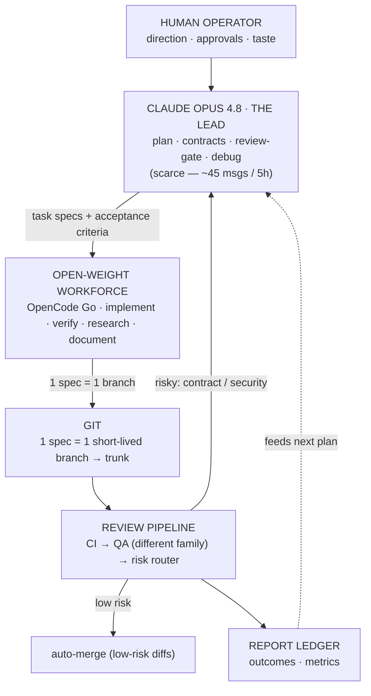

# Session Handoff — AI-Dev-OS

> Resume cold: read §1–§2 (especially the **tooling split** in §2), then §3 is the live state
> (machine-generated) and §4 links everything open or shipped. Only **durable** prose is hand-written here —
> volatile facts are generated or linked, so this doc can't go stale.

---

## 1. What this project is
**AI-Dev-OS** — a scarce premium model (**Claude Opus 4.8, "the Lead"**) produces specs, contracts, and
reviews; cheap **open-weight models** (via the **OpenCode Go** gateway) do the bulk implement / verify /
research / document work. The Lead never types CRUD — it spends its limited messages only at leverage points
(architecture, the review gate, hard bugs). Routing: **Leverage = BlastRadius × Irreversibility × SpecGap**.

- **Repo:** github.com/Hassa-Dollar/AI-OS — **PUBLIC by choice, security-first** (never commit secrets;
  `gitleaks` gates every push; see `CLAUDE.md` §8).
- **The products it builds** live as self-contained, extractable **components** (`components/<name>/`), each
  governed by one **profile** and coupled to others only through a **contract** (one-way isolation, ADR-0002).
  The current inventory is generated in §3; the active product's full plan is at the repo root (e.g.
  `shrink-build-plan.md`).
- **Canonical docs:** `CLAUDE.md` (Lead protocol) · `AGENTS.md` (workforce rules + the 7-model catalog) ·
  `OPERATING_MANUAL.md` (full-system doctrine) · `architecture/README.md` (the generated module map).

---

## 2. Where it lives + how to work on it  (CRITICAL — read before touching anything)

- **Location:** WSL native filesystem — `~/projects/AI-OS` = `\\wsl.localhost\Ubuntu\home\hassa\projects\AI-OS`.
- **NOT in OneDrive** — OneDrive corrupts `.git` (proven: index corruption). Never move it back.
- **Tooling split (important for Claude):**
  - The **bash sandbox CANNOT** mount the `\\wsl.localhost\` UNC path ("UNC paths not supported").
  - The **file tools (Read/Write/Edit) CAN** reach it. So **Claude edits files via the file tools**; **the
    human runs git / bash / scripts / opencode / npm** in their WSL terminal.
  - The file-tool path cache is **case-sensitive** (`Ubuntu` vs `ubuntu`) — pick one and stay consistent.
- **WSL toolchain (installed & working):** Node 22, npm global prefix `~/.npm-global` (no sudo), `opencode`
  CLI (authed to OpenCode Go), `gh` CLI (authed), `gitleaks`. Windows-PATH interop is disabled in
  `/etc/wsl.conf` so Windows binaries don't shadow the Linux ones.
- **GitHub:** branch protection on `main` requires the **`os-ci/os` + `product-ci/product`** checks
  (`enforce_admins`). All changes land via **PR → auto-merge**; `gate.sh` runs in **PR mode**
  (`GATE_MERGE=pr`; `local` fallback exists).
- **Daily cycle — two commands per task:** `scripts/dispatch.sh <id>` (worker implements on a task branch)
  then `scripts/ship.sh <id>` (gate → PR/auto-merge → land). Risk-flagged diffs stop at a DRAFT PR for the
  Opus gate. Lead chores (docs/scripts): commit on a `fix/*` or `chore/*` branch, then
  **`bash scripts/pr.sh`** (push → PR → auto-merge → land) — not `ship.sh` (its gate needs a task spec).

---

## 3. Live state  (generated — do not hand-edit)
<!-- AUTO-STATE:BEGIN — generated by scripts/handoff.sh @ 2026-06-27T01:50:47Z; do not hand-edit -->
- **main:** `ff504e8 Merge pull request #55 from Hassa-Dollar/feat/toolchain-doctor`
- **checked-out branch:** `main` · worktree: clean
- **active task specs:** none · completed: 0
- **open PRs:** none
- **last ledger events:**
```
2026-06-25T23:21:48Z,land,coherence,main,hassa,"branch=feat/coherence-links-stubs main=a9369f94"
2026-06-26T20:13:15Z,land,backlog,main,hassa,"branch=chore/backlog-self-healing-ci main=05208cef"
2026-06-26T20:30:50Z,land,dynamic,main,hassa,"branch=feat/dynamic-role-docs main=dad8ace9"
2026-06-26T21:14:37Z,land,db,main,hassa,"branch=feat/db-access-control main=44f08d71"
2026-06-26T22:11:31Z,land,bootstrap,main,hassa,"branch=feat/bootstrap-provision main=8180aa5e"
2026-06-27T01:50:47Z,land,toolchain,main,hassa,"branch=feat/toolchain-doctor main=ff504e87"
```
<!-- AUTO-STATE:END -->

<!-- AUTO-INVENTORY:BEGIN — generated by scripts/handoff.sh; do not hand-edit (deterministic: no timestamp, so verify-no-diff works — Step 4) -->
**Components (the deliverables built by the system):**
- `api` → profile `web-app/ts-hono-api` · stub (no src/ yet)
- `web` → profile `web-app/react-vite` · stub (no src/ yet)

**Profiles available** (each a fixed-catalog binding under `profiles/<family>/<variant>/`):
- `web-app/react-vite`
- `web-app/ts-hono-api`
- `web-app/ts-node-service`
<!-- AUTO-INVENTORY:END -->

> Live status = the blocks above **+ the task list + the latest ledger rows** (`reports/metrics/ledger.csv`).
> These are machine-written (`land.sh` refreshes them after every merge, or run `scripts/handoff.sh`).

---

## 4. What's open and what shipped  (read the live sources — no hand-narration that rots)
- **Open work:** the task list + any `tasks/active/*.md` specs.
- **History / the *why*:** the ledger (`reports/metrics/ledger.csv`), the bug registry
  (`knowledge/postmortems/registry.md`), the ADRs (`architecture/adr/`), and `git log`.
- **Completed task specs (generated):**
<!-- AUTO-SHIPPED:BEGIN — generated by scripts/handoff.sh @ 2026-06-27T01:50:47Z; do not hand-edit -->
- (no completed task specs yet)
<!-- AUTO-SHIPPED:END -->

---

## 5. Recurring gotchas (will bite the next session if forgotten)
- **Run scripts via `bash scripts/<x>.sh`.** Editing a script via the file tools strips its `+x` bit, so a
  direct `scripts/<x>.sh` can fail "Permission denied" — `bash …` sidesteps it entirely.
- **Pre-push: `bash scripts/ci-local.sh`** — mirrors os-ci locally (shellcheck · exec-bit · sibling-exec ·
  component-isolation · bats · gitleaks), so failures surface before the PR, not after.
- **`gate.sh` reuses an existing verdict** `reviews/verdicts/<id>.txt`. After a FAIL, `rm` it before re-gating.
- **Branches off an old `main`** lack later fixes. `gate.sh` rebases onto `main` first — the worktree must be
  **clean** (commit the worker's output first).
- **`main` is protected** — no direct pushes; everything lands via PR → auto-merge.
- **Cowork tooling quirks:** the bash sandbox won't start while the `\\wsl.localhost\` UNC folder is mounted
  → file tools only; the human runs every git/npm/script command. `Grep` works on the UNC path; `Glob` works
  only if you pass the target subdir as its `path` (the `literaldir/**` prefix form returns "No files found").
- **`git add -A` sweeps untracked dirs** into the commit — eyeball `git status -s` first.
- **`gh pr checks` exits 1 with "no checks reported"** in the first seconds after a PR opens (Actions
  scheduling lag; exit 8 = pending). `land.sh` polls for reported-state first — not a CI failure.

---

## 6. The workforce + the build loop
- **Catalog & roles:** a fixed set of **7 OpenCode-Go models** (ADR-0005); **roles bind per profile** in each
  `profiles/<family>/<variant>/profile.json`, **not globally** (ADR-0003) — which model plays a role depends on
  the component (e.g. the frontend implementer is MiniMax M3). Catalog + strengths live in **`AGENTS.md` §1**
  (single source — not duplicated here). P8 (verifier ≠ author family) is enforced by `dispatch.sh`.
- **The Lead** is Claude Opus 4.8 (scarce, ~45 msgs/5h) — not a workforce model.
- **Diagram:** `docs/handoff/ai-dev-os-build-loop.svg` (text version below).


