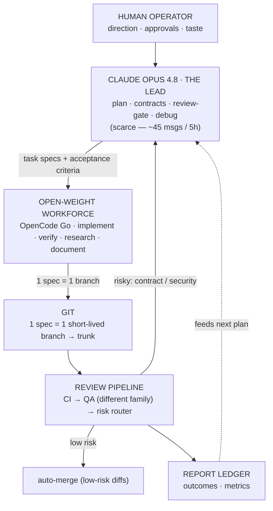

# Session Handoff — AI-Dev-OS

> Purpose: let a fresh Cowork session (any Claude model) resume this project cold.
> Read this top to bottom first, then jump to **"Where we are right now."**

---

## 1. What this project is

**AI-Dev-OS** — an orchestration system where a scarce, premium model (**Claude Opus 4.8, "the Lead"**)
produces **specs, contracts, and reviews**, and cheap **open-weight models** (via the **OpenCode Go**
gateway) do the bulk **implement / verify / research / document** work. The Lead never types CRUD;
it spends its limited messages only at leverage points (architecture, the review gate, hard bugs).

- Repo: **github.com/Hassa-Dollar/AI-OS** — **PUBLIC by choice, security-first** (never commit secrets;
  `gitleaks` gates every push). See `CLAUDE.md` §8.
- Stack: **Node 22 + TypeScript** (ESM, strict). The product being built is a tiny `node:http` service.
- Canonical docs already in the repo: `OPERATING_MANUAL.md` (full system), `CLAUDE.md` (Lead protocol),
  `AGENTS.md` (workforce rules + model pins), `architecture/README.md` (module map).

---

## 2. Where the project lives + how to work on it  (CRITICAL — read before touching anything)

- **Location:** WSL native filesystem — `~/projects/AI-OS` = `\\wsl.localhost\Ubuntu\home\hassa\projects\AI-OS`.
- **NOT in OneDrive.** OneDrive corrupts `.git` (proven: index corruption, unwritable `.git/index`). Never move it back.
- **Tooling split (important for Claude):**
  - The **bash sandbox CANNOT** mount the `\\wsl.localhost\` UNC path (errors with "UNC paths not supported").
  - The **file tools (Read/Write/Edit) CAN** reach it. So **Claude edits files via the file tools** at the
    `\\wsl.localhost\Ubuntu\...` path; **the human runs git / bash / scripts / opencode / npm** in their WSL terminal.
  - The file-tool path cache is **case-sensitive** (`Ubuntu` vs `ubuntu`) — pick one and stay consistent.
- **WSL toolchain (all installed & working):** Node 22 (`/usr/bin/node`), npm global prefix `~/.npm-global`
  (no sudo), `opencode` CLI (native Linux, authenticated to OpenCode Go), `gh` CLI (authenticated),
  `gitleaks` 8.24.3 (`/usr/local/bin`). Windows-PATH interop is **disabled** in `/etc/wsl.conf`
  (`appendWindowsPath = false`) so Windows binaries don't shadow the Linux ones.
- **GitHub:** branch protection on `main` (requires the `gate` status check, `enforce_admins`). All changes
  land via **PR → auto-merge**. `gate.sh` runs in **PR mode** (`GATE_MERGE=pr`; `local` fallback exists).

---

## 3. What we did this session (setup + hardening — all merged)

1. Relocated repo OneDrive → WSL; normalized line endings to **LF** (`.gitattributes`).
2. Pinned the real gateway slugs **`opencode-go/*`** (the free `opencode/*` tier lacks the strong models)
   in `AGENTS.md`, `scripts/new-task.sh`, and the example task. No `-thinking` slug exists; Kimi K2.6 serves the autonomous hat.
3. Wired CI: `scripts/ci-env.sh` (Node/TS commands) + recreated `.github/workflows/ci.yml`. **gitleaks-action
   needs `env: GITHUB_TOKEN: ${{ secrets.GITHUB_TOKEN }}`** to scan PRs — that fix is in.
4. Replaced placeholder invariants + `AGENTS.md` §4 conventions for TS/Node; wrote a real `architecture/README.md`.
5. Scaffolded the Node/TS skeleton: `package.json`, `tsconfig` (strict), `eslint.config.js` (flat), `vitest.config.ts`
   (coverage **report-only**, no hard global threshold — diff-coverage is the intended rule), `src/app.ts` (factory
   + tiny exact-match router), `src/routes/` (self-registered routes), `src/server.ts`, tests.
6. Recorded the **public + security-first posture** in `CLAUDE.md` §8.
7. Added a **pre-push hook** `.githooks/pre-push` (enable once: `git config core.hooksPath .githooks`).
8. Converted `gate.sh` to **PR mode**; fixed its verdict parser to tolerate markdown (`**VERDICT:** **pass**`);
   it now clears the verdict after an approve; gitignored `reviews/verdicts/*` and `reviews/queue/*`.

---

## 4. Tasks shipped through the pipeline

- **Task 000 — `GET /health`** → **MERGED.** GLM-5.1 implemented, DeepSeek V4 Pro QA'd cross-family, auto-merged via PR. Clean.
- **Task 001 — router pathname match** → **IN PROGRESS.** See next section.

---

## 5. ⏯️ WHERE WE ARE RIGHT NOW  (resume here)

**Goal of task 001:** make `createApp` match on the URL **path only** so `GET /health?probe=1` reaches `/health`.

**What happened:** GLM-5.1 implemented it with `new URL(req.url, base).pathname`. DeepSeek's QA caught a real bug:
`new URL().pathname` **normalizes dot-segments** — `/../health` → `/health`, `/./health` → `/health` — so the
"exact match" router would match traversal-style paths (a path-normalization matching leak). It even proved it with
a **raw TCP request** (since `fetch` normalizes client-side). Verdict: **fail**. (Note: the verifier also *edited*
`src/app.test.ts` to add two failing regression tests — helpful, but a separation-of-powers overstep; see follow-ups.)

**What the Lead did (this session):** fixed `src/app.ts` — replaced `new URL(...).pathname` with
`(req.url ?? '/').split('?')[0] ?? '/'` (strips the query, **no** normalization). DeepSeek's two traversal tests now pass.

**State on disk (branch `task/001-router-pathname-match`):** the `app.ts` fix and DeepSeek's traversal tests in
`src/app.test.ts` are written but **NOT yet committed**, and `reviews/verdicts/001.txt` still holds the stale FAIL verdict.

**Exact next steps (run in the WSL terminal):**

```bash
cd ~/projects/AI-OS
npm test && npm run typecheck && npm run lint     # expect 9/9 pass
git add -A
git commit -m "fix(app): exact path match via query-strip, not new URL (no dot-segment normalization)"
rm -f reviews/verdicts/001.txt                     # clear the FAIL verdict so QA re-runs fresh
scripts/gate.sh 001                                # → CI → fresh DeepSeek QA → CLEAR → auto-merge PR
# after it merges:
git checkout main && git pull
git branch -D task/001-router-pathname-match
```

---

## 6. Open follow-ups (Lead's to-do — surfaced by the runs)

1. **`prompts/task-execution.md`** — make the final `git add -A && git commit` a **mandatory explicit step**
   (GLM skipped committing on task 001, which made `gate.sh`'s rebase fail).
2. **`prompts/code-review.md`** — instruct the verifier to **only emit a verdict, never edit files**
   (DeepSeek edited `src/app.test.ts` during QA — breaks cross-family independence).
3. **`scripts/gate.sh`** — distinguish "uncommitted changes" from "semantic conflict" **before** the rebase
   (it printed a misleading "semantic conflict / escalate" when the real cause was the worker not committing).
4. **Spec/`AGENTS.md`** — explicitly allow `reports/tasks/<id>-completion.md` as an output (it's required by
   AGENTS §6 but sits outside `files_allowed`; both QA runs flagged the ambiguity).

---

## 7. Recurring gotchas (will bite the next session if forgotten)

- **Editing a script via the file tools strips its `+x` bit.** `chmod +x scripts/<x>.sh` before committing, or run via `bash scripts/<x>.sh`.
- **`gate.sh` reuses an existing verdict** `reviews/verdicts/<id>.txt`. After a FAIL, `rm` it before re-gating or QA is skipped.
- **Branches made off an old `main`** lack later fixes. `gate.sh` rebases onto `main` first — but the worktree must be **clean** (commit the worker's output first).
- **`main` is protected** — no direct pushes. Everything goes via `gh pr create --fill --base main && gh pr merge --auto --merge`.

---

## 8. The model roster

| Model | Role | Why | Gateway slug |
|---|---|---|---|
| **Claude Opus 4.8** | **Lead** | architecture · review gate · hard debugging (scarce, ~45 msgs/5h) | — (Claude Pro / API) |
| GLM-5.1 | Implementer (default) | reliable spec-to-code, long-horizon | `opencode-go/glm-5.1` |
| Kimi K2.6 | Autonomous worker + Verifier | tops agentic-coding; best long autonomous runs | `opencode-go/kimi-k2.6` |
| DeepSeek V4 Pro | Verifier | breaks code at the edges; ≠ author family (P8) | `opencode-go/deepseek-v4-pro` |
| Qwen3.7 Max | Researcher | 1M-context spikes → decision memos | `opencode-go/qwen3.7-max` |
| Qwen3.7 Plus | 2nd implementer / weekly synth | parallel impl; drafts weekly (Opus signs off) | `opencode-go/qwen3.7-plus` |
| MiniMax M3 | Multimodal | builds UI from designs & screenshots | `opencode-go/minimax-m3` |
| MiMo-V2.5-Pro | Scribe (mechanical) | docstrings · changelogs · template fill | `opencode-go/mimo-v2.5-pro` |
| local Qwen3-Coder-Next | Fallback | offline / secret-sensitive · $0 | `ollama/qwen3-coder-next` |

**Routing = blast-radius × irreversibility × spec-gap · P8: verifier ≠ author's model family · stack ≈ $30/mo.**

---

## 9. The build loop (diagram)

The polished version is the PNG saved alongside this handoff (`ai-dev-os-architecture-diagram.png`). Text version:


